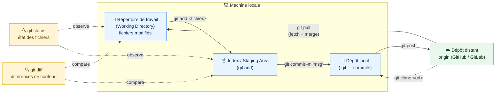

# demo-BUT2-2026

Schéma:

```mermaid
flowchart LR
    subgraph LOCAL["💻 Machine locale"]
        WD["📁 Répertoire de travail<br/>(Working Directory)<br/>fichiers modifiés"]
        IDX["📦 Index / Staging Area<br/>(git add)"]
        REPO["💾 Dépôt local<br/>(.git — commits)"]
    end

    REMOTE["☁️ Dépôt distant<br/>origin (GitHub / GitLab)"]

    WD -- "git add &lt;fichier&gt;" --> IDX
    IDX -- "git commit -m 'msg'" --> REPO
    REPO -- "git push" --> REMOTE
    REMOTE -- "git pull<br/>(fetch + merge)" --> WD
    REMOTE -. "git clone &lt;url&gt;" .-> REPO

    STATUS["🔍 git status<br/>état des fichiers"]
    DIFF["🔍 git diff<br/>différences de contenu"]

    STATUS -. "observe" .-> WD
    STATUS -. "observe" .-> IDX
    DIFF -. "compare" .-> WD
    DIFF -. "compare" .-> IDX

    classDef zone fill:#e8f4ff,stroke:#2b7de9,color:#0b2d5c;
    classDef cmd fill:#fff4d6,stroke:#e0a800,color:#5c4400;
    classDef dist fill:#e9f7ec,stroke:#28a745,color:#0d3d1c;
    class WD,IDX,REPO zone;
    class STATUS,DIFF cmd;
    class REMOTE dist;
```
## Guézou

Test

- **Salut la team comment ça va edgar-nael.
